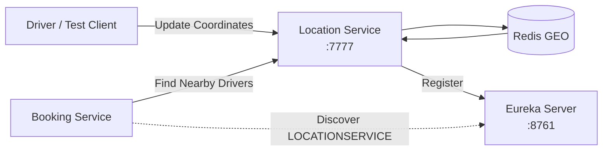

# RideFlow Location Service

RideFlow Location Service stores driver coordinates and searches for drivers near a requested pickup location.

The current implementation uses **Redis GEO** operations for geospatial indexing and registers itself with RideFlow Service Discovery.

---

## Runtime

| Property              | Value             |
| --------------------- | ----------------- |
| Application           | `LocationService` |
| Port                  | `7777`            |
| Geospatial Store      | Redis GEO         |
| Nearby Search Radius  | `5 km`            |
| Discovery             | Eureka Client     |
| Shared Entity Version | `0.0.4-SNAPSHOT`  |

> Location Service currently remains on EntityService `0.0.4-SNAPSHOT`, while several other RideFlow services use `0.0.7-SNAPSHOT`.

---

## What This Service Does

The service currently supports two main operations:

```text
Save Driver Location
        ↓
Store coordinates in Redis GEO
```

and:

```text
Pickup Coordinates
        ↓
Search Redis GEO
        ↓
Find Drivers Within 5 km
        ↓
Return Driver Locations
```

---

## Architecture



---

## Role in RideFlow

Location Service is used by Booking Service during ride creation.

The high-level flow is:

```text
Passenger Creates Booking
        ↓
Booking Service
        ↓
Pickup Latitude / Longitude
        ↓
Location Service
        ↓
Redis GEO Search
        ↓
Nearby Drivers
```

Booking Service discovers this application through Eureka using the logical service name:

```text
LOCATIONSERVICE
```

---

## API Base Path

```text
/api/location
```

Current endpoints:

| Method | Endpoint          | Purpose                                 |
| ------ | ----------------- | --------------------------------------- |
| POST   | `/drivers`        | Save/update a driver's current location |
| POST   | `/nearby/drivers` | Find drivers close to a pickup point    |

---

# 1. Save Driver Location

Endpoint:

```http
POST /api/location/drivers
```

This endpoint stores the driver's current coordinates in Redis.

Example request:

```json
{
  "driverId": "201",
  "latitude": 17.385,
  "longitude": 78.4867
}
```

Expected response:

```json
true
```

Expected HTTP status:

```text
201 Created
```

---

## Internal Flow

```text
POST /api/location/drivers
        ↓
LocationController
        ↓
LocationService
        ↓
Redis GEOADD
        ↓
drivers GEO key
```

Conceptually, Redis stores:

```text
driverId
   +
longitude
   +
latitude
```

inside a GEO index.

---

# 2. Find Nearby Drivers

Endpoint:

```http
POST /api/location/nearby/drivers
```

Example request:

```json
{
  "latitude": 17.385,
  "longitude": 78.4867
}
```

Example response:

```json
[
  {
    "driverId": "201",
    "latitude": 17.385,
    "longitude": 78.4867
  },
  {
    "driverId": "202",
    "latitude": 17.389,
    "longitude": 78.49
  }
]
```

The service currently searches within:

```text
5 km
```

of the supplied coordinates.

---

## Nearby Search Flow

```text
Pickup Latitude / Longitude
        ↓
Redis GEO radius search
        ↓
Driver IDs inside 5 km
        ↓
Fetch stored positions
        ↓
DriverLocationDto[]
```

---

## Redis GEO

The current implementation uses Spring Data Redis GEO operations.

The driver GEO key is:

```text
drivers
```

Conceptually:

```text
drivers
 ├── 201 → longitude, latitude
 ├── 202 → longitude, latitude
 └── 203 → longitude, latitude
```

This allows Redis to efficiently answer geospatial queries such as:

```text
Which drivers are within 5 km of this pickup location?
```

---

## Why Redis GEO Is Used

A normal database query could store:

```text
latitude
longitude
```

for each driver.

But finding nearby drivers would require distance calculations across potentially many rows.

Redis GEO provides built-in geospatial indexing and radius/distance queries.

That makes it suitable for:

* current driver locations
* nearby-driver lookup
* frequently changing coordinates
* low-latency geographic searches

---

## Swagger / OpenAPI Status

Springdoc/OpenAPI is **not currently configured** in Location Service's `main` branch.

Therefore there is currently no Location Service Swagger UI.

Use:

* Postman
* cURL
* another REST client

for testing.

---

## Testing With cURL

### Save Driver Location

Linux/macOS:

```bash
curl -X POST http://localhost:7777/api/location/drivers \
  -H "Content-Type: application/json" \
  -d '{
    "driverId": "201",
    "latitude": 17.385,
    "longitude": 78.4867
  }'
```

Windows PowerShell users can also test the endpoint through Postman or `Invoke-RestMethod`.

---

### Find Nearby Drivers

```bash
curl -X POST http://localhost:7777/api/location/nearby/drivers \
  -H "Content-Type: application/json" \
  -d '{
    "latitude": 17.385,
    "longitude": 78.4867
  }'
```

---

## Testing With Postman

### Request 1 — Store Driver Location

```text
Method:
POST
```

URL:

```text
http://localhost:7777/api/location/drivers
```

Body:

```json
{
  "driverId": "201",
  "latitude": 17.385,
  "longitude": 78.4867
}
```

---

### Request 2 — Find Nearby Drivers

```text
Method:
POST
```

URL:

```text
http://localhost:7777/api/location/nearby/drivers
```

Body:

```json
{
  "latitude": 17.385,
  "longitude": 78.4867
}
```

---

## Recommended Test Scenario

Store multiple drivers at different coordinates.

For example:

### Driver 201

```json
{
  "driverId": "201",
  "latitude": 17.385,
  "longitude": 78.4867
}
```

### Driver 202

```json
{
  "driverId": "202",
  "latitude": 17.39,
  "longitude": 78.49
}
```

### Driver 203

```json
{
  "driverId": "203",
  "latitude": 18.52,
  "longitude": 73.85
}
```

Then search near:

```json
{
  "latitude": 17.385,
  "longitude": 78.4867
}
```

Drivers near Hyderabad should be returned while a sufficiently distant driver should not appear in the 5 km result.

---

## Redis Setup

The service requires Redis.

Typical local Redis address:

```text
localhost:6379
```

Verify Redis is running before starting Location Service.

You can test Redis using:

```bash
redis-cli ping
```

Expected:

```text
PONG
```

---

## Inspecting Redis GEO Data

You can inspect the GEO key:

```bash
redis-cli
```

Then:

```text
ZRANGE drivers 0 -1
```

This shows the stored driver IDs.

You can also use Redis geospatial commands for debugging.

---

## Eureka Configuration

Current application identity:

```properties
spring.application.name=LocationService
```

Port:

```properties
server.port=7777
```

Eureka configuration:

```properties
eureka.client.service-url.defaultZone=http://localhost:8761/eureka
eureka.instance.preferIpAddress=true
```

After startup, open:

```text
http://localhost:8761
```

and verify:

```text
LOCATIONSERVICE
```

appears in the registered applications.

---

## Why Eureka Matters Here

Booking Service should not need to know:

```text
localhost:7777
```

directly.

Instead it asks Eureka for:

```text
LOCATIONSERVICE
```

The discovery layer provides the available instance.

Conceptually:

```text
Booking Service
      ↓
Eureka
      ↓
LOCATIONSERVICE
      ↓
Location Service instance
```

---

## Booking Service Integration

Booking Service calls:

```text
POST /api/location/nearby/drivers
```

through its Retrofit client.

Simplified flow:

```text
Booking Request
     ↓
Booking persisted
     ↓
Pickup coordinates extracted
     ↓
Location Service called
     ↓
Nearby drivers returned
     ↓
Booking Service starts Socket dispatch
```

---

## Technology Stack

* Java 17
* Spring Boot 4.1.1
* Spring MVC
* Spring Data Redis
* Redis GEO
* Netflix Eureka Client
* Spring Data MongoDB dependency
* Lombok
* Gradle
* RideFlow EntityService

---

## Redis vs MongoDB in Current Implementation

The project currently contains MongoDB-related dependencies, but the active nearby-driver implementation uses:

```text
Redis GEO
```

The main location flow does not currently depend on MongoDB.

---

## Shared Entity Dependency

Location Service currently uses:

```gradle
implementation 'com.rideflow:Rideflow-EntityService:0.0.4-SNAPSHOT'
```

This differs from several other RideFlow repositories currently using:

```text
0.0.7-SNAPSHOT
```

Before upgrading Location Service, verify that the latest entity changes remain compatible with its code and expected database/model usage.

---

## Prerequisites

Before running Location Service, ensure:

* JDK 17+ is installed
* Redis is running
* Service Discovery is running
* required EntityService snapshot is available in Maven Local

---

## Publish the Required EntityService

If `0.0.4-SNAPSHOT` is required by the current Location branch, that version needs to exist locally.

Entity artifacts are resolved using:

```gradle
mavenLocal()
```

Typical publication command from EntityService:

### Windows

```bash
gradlew.bat publishToMavenLocal
```

### Linux / macOS

```bash
./gradlew publishToMavenLocal
```

---

## Recommended Startup Order

For Location Service itself:

```text
1. Redis
2. Publish required EntityService snapshot
3. Service Discovery
4. Location Service
```

For the full distributed booking flow:

```text
1. MySQL
2. Redis
3. Kafka
4. EntityService
5. Service Discovery
6. Location Service
7. Socket Server
8. Booking Service
```

---

## Running the Application

### Windows

```bash
gradlew.bat bootRun
```

### Linux / macOS

```bash
./gradlew bootRun
```

Location API:

```text
http://localhost:7777/api/location
```

---

## Project Structure

```text
src/main/java/
└── ...
    ├── configuration/
    │   └── RedisConfig.java
    ├── controller/
    │   └── LocationController.java
    ├── dto/
    │   ├── DriverLocationDto.java
    │   ├── NearbyDriversRequestDto.java
    │   └── SaveDriverLocationRequestDto.java
    ├── service/
    │   ├── LocationService.java
    │   └── RedisLocationServiceImpl.java
    └── LocationServiceApplication.java
```

---

## Current Implementation Notes

* driver locations are stored in Redis GEO
* Redis GEO key is `drivers`
* nearby-driver search currently uses a fixed radius of 5 km
* Location Service registers with Eureka
* Booking Service discovers it using `LOCATIONSERVICE`
* no Swagger/OpenAPI configuration currently exists
* MongoDB is not part of the active Redis GEO flow
* driver availability is not currently evaluated during the location search
* EntityService dependency is currently older than most other RideFlow services

---

## Current Limitations

### Fixed Search Radius

The search currently always uses:

```text
5 km
```

A future implementation could progressively expand the radius:

```text
2 km
5 km
10 km
15 km
```

until enough drivers are found.

---

### No Availability Filtering

A nearby driver is not necessarily an available driver.

A stronger implementation could combine:

```text
Geographic proximity
        +
Driver availability
        +
Driver approval status
        +
Vehicle requirements
```

---

### No Location Expiration

Driver coordinates can become stale.

A production design should track when the driver last updated their position and avoid returning inactive/stale drivers.

---

## Future Improvements

* add Springdoc/OpenAPI documentation
* align EntityService version with the rest of RideFlow
* incorporate driver availability
* expire stale locations
* allow configurable/dynamic search radius
* periodically remove disconnected drivers
* add geospatial integration tests
* add Redis failure handling
* introduce location update timestamps
* consider driver-location events through Kafka

---

## Parent Project

See the complete RideFlow project:

[RideFlow](https://github.com/Abhilash-Panja/RideFlow)
