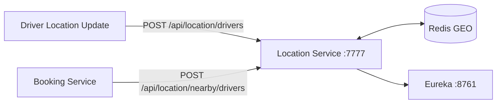

# RideFlow Location Service

Location Service manages live driver coordinates and finds drivers near a requested pickup point. The current implementation uses **Redis GEO operations** and registers with RideFlow's Eureka server.

## Runtime

| Property | Value |
|---|---|
| Application name | `LocationService` |
| Port | `7777` |
| Service discovery | Eureka client |
| Location store | Redis GEO |
| Current search radius | `5 km` |
| Shared model dependency | `Rideflow-EntityService:0.0.4-SNAPSHOT` |

## Role in RideFlow



Booking Service discovers this service from Eureka using the service name:

```text
LOCATIONSERVICE
```

## API

Base path:

```text
/api/location
```

### Save Driver Location

```http
POST /api/location/drivers
Content-Type: application/json
```

Example:

```json
{
  "driverId": "1",
  "latitude": 17.3850,
  "longitude": 78.4867
}
```

Successful response:

```json
true
```

Status:

```text
201 Created
```

The location is stored under the Redis GEO key:

```text
drivers
```

### Find Nearby Drivers

```http
POST /api/location/nearby/drivers
Content-Type: application/json
```

Example:

```json
{
  "latitude": 17.3850,
  "longitude": 78.4867
}
```

Example response:

```json
[
  {
    "driverId": "1",
    "latitude": 17.3850,
    "longitude": 78.4867
  }
]
```

The current service implementation searches within:

```text
5 kilometers
```

of the supplied point.

## Tech Stack

- Java 17
- Spring Boot 4.1.1
- Spring MVC
- Spring Data Redis
- Redis GEO
- Spring Cloud Netflix Eureka Client
- Lombok
- Gradle
- shared RideFlow EntityService models

The Gradle build also currently includes the MongoDB starter, although the checked-in location workflow is implemented through Redis.

## Prerequisites

- JDK 17+
- Redis
- Eureka / Service Discovery
- required shared EntityService artifact in Maven Local

### Redis

Spring Boot defaults can be used for local development:

```text
localhost:6379
```

You can explicitly configure:

```properties
spring.data.redis.host=localhost
spring.data.redis.port=6379
```

or environment variables:

```text
SPRING_DATA_REDIS_HOST=localhost
SPRING_DATA_REDIS_PORT=6379
```

### Eureka

The current configuration uses:

```properties
eureka.client.service-url.defaultZone=http://localhost:8761/eureka
eureka.instance.preferIpAddress=true
```

Start Service Discovery before this service.

## Shared Entity Dependency

Current dependency:

```text
com.rideflow:Rideflow-EntityService:0.0.4-SNAPSHOT
```

If the artifact is not available:

```bash
cd ../Rideflow-EntityService
./gradlew publishToMavenLocal
```

If the EntityService repository has moved to a newer version, align this service's dependency accordingly.

## Run

```bash
# Linux/macOS
./gradlew bootRun

# Windows
gradlew.bat bootRun
```

The API is available at:

```text
http://localhost:7777
```

and the service should appear in Eureka as:

```text
LOCATIONSERVICE
```

## Project Structure

```text
src/main/java/com/rideflow/locationservice/
├── LocationServiceApplication.java
├── configuration/
│   └── RedisConfig.java
├── controller/
│   └── LocationController.java
├── dto/
│   ├── DriverLocationDto.java
│   ├── NearbyDriversRequestDto.java
│   └── SaveDriverLocationRequestDto.java
└── service/
    ├── LocationService.java
    └── RedisLocationServiceImpl.java
```

## How Booking Service Uses It

Booking Service builds a request from the booking pickup coordinates and calls:

```text
POST /api/location/nearby/drivers
```

through a Retrofit client whose base URL is resolved from Eureka.

Once nearby drivers are returned, Booking Service continues the dispatch flow by asking Socket Server to broadcast a ride request.

## Current Implementation Notes

- Redis GEO key: `drivers`
- search radius: `5 km`
- failures in the controller currently return `500 Internal Server Error`
- no pagination/ranking contract is currently exposed
- the active implementation is Redis-based
- Springdoc/OpenAPI is not currently configured

## Parent Project

[RideFlow](https://github.com/Abhilash-Panja/RideFlow)
